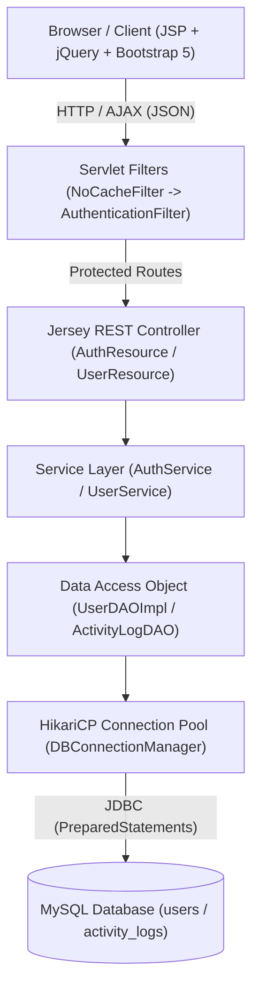
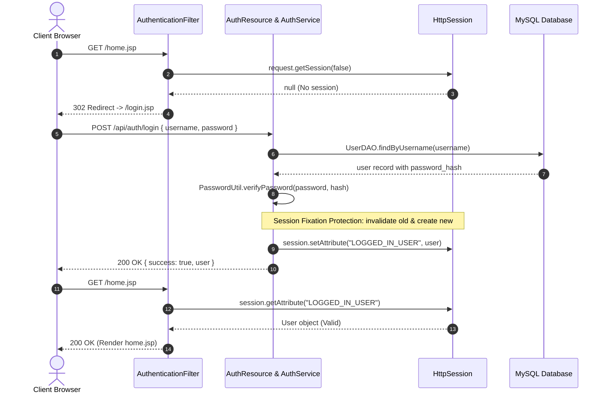

# Enterprise User Management System - Technical Implementation & Interview Guide

This document provides a comprehensive technical breakdown of the architecture, database queries, security mechanisms, and design decisions implemented in this application. It is structured to help you master every aspect of the project and speak with confidence in technical interviews.

---

## 🏛️ 1. Architecture Overview

The application follows the classic **N-Tier Enterprise Architecture** pattern, enforcing strict separation of concerns across presentation, business logic, data access, and persistence.



### Layer Responsibilities

1. **Presentation Layer (`src/main/webapp/`)**:
   - `login.jsp`, `home.jsp`, and reusable includes (`header.jsp`, `navbar.jsp`, `footer.jsp`).
   - jQuery handles user events (clicks, typing, modal submits), sends asynchronous AJAX requests with JSON payloads, and dynamically updates the DOM without page refreshes.
   - Bootstrap 5 provides a modern responsive layout with clean cards, badges, and modals.
2. **Security & Interception Layer (`com.usermanagement.filter`)**:
   - `NoCacheFilter`: Disables HTTP caching for all routes to prevent unauthorized viewing through the browser's "Back" button after logout.
   - `AuthenticationFilter`: Enforces session validation on protected JSP views and REST APIs.
3. **Web / REST Layer (`com.usermanagement.web`)**:
   - Built with **Jersey 2.x (JAX-RS 2.1)**.
   - Exposes RESTful endpoints under `/api/*` consuming and producing `application/json`.
   - Maps HTTP verbs to standard operations: `GET` (read), `POST` (create), `PUT` (update), `DELETE` (remove).
4. **Service Layer (`com.usermanagement.service`)**:
   - Contains core business logic, input validation rules (username regex, email RFC format, minimum password length), and RBAC role checks.
   - Orchestrates auditing via `ActivityLogDAO`.
5. **Data Access Layer (`com.usermanagement.dao`)**:
   - Implements the DAO Pattern (`UserDAO` interface and `UserDAOImpl` concrete class).
   - Encapsulates all SQL statements using **JDBC `PreparedStatement`** to guarantee immunity from SQL Injection.
6. **Connection Pool & Utilities (`com.usermanagement.util`)**:
   - `DBConnectionManager`: Singleton managing a **HikariCP** pool for connection reuse and performance.
   - `PasswordUtil`: BCrypt hashing and cryptographic salt generator.
   - `DBInitializer`: Executes schema migration script on startup.

---

## 🗄️ 2. Database Design & SQL Query Deep-Dive

### 2.1 Schema Definition

#### Table: `users`
Stores user credentials, profile information, and account status.

| Column | Data Type | Constraints | Description |
|---|---|---|---|
| `id` | `INT` | `AUTO_INCREMENT PRIMARY KEY` | Unique identifier |
| `username` | `VARCHAR(50)` | `NOT NULL UNIQUE` | Login handle (3-30 alphanumeric chars) |
| `password_hash` | `VARCHAR(255)` | `NOT NULL` | BCrypt hash with embedded salt and work factor |
| `salt` | `VARCHAR(64)` | `DEFAULT NULL` | Cryptographic salt metadata |
| `full_name` | `VARCHAR(100)` | `NOT NULL` | User's display name |
| `email` | `VARCHAR(100)` | `NOT NULL UNIQUE` | Unique contact email address |
| `role` | `VARCHAR(20)` | `NOT NULL DEFAULT 'USER'` | RBAC role: `ADMIN`, `MANAGER`, or `USER` |
| `status` | `VARCHAR(20)` | `NOT NULL DEFAULT 'ACTIVE'` | Account state: `ACTIVE` or `INACTIVE` |
| `created_at` | `TIMESTAMP` | `DEFAULT CURRENT_TIMESTAMP` | Account creation timestamp |
| `updated_at` | `TIMESTAMP` | `DEFAULT CURRENT_TIMESTAMP` | Record modification timestamp |

#### Table: `activity_logs`
Enterprise audit trail tracking critical security and data manipulation events.

| Column | Data Type | Constraints | Description |
|---|---|---|---|
| `id` | `INT` | `AUTO_INCREMENT PRIMARY KEY` | Audit entry ID |
| `user_id` | `INT` | `FOREIGN KEY REFERENCES users(id)` | User who triggered the action |
| `username` | `VARCHAR(50)` | `NULLABLE` | Username snapshot for historical integrity |
| `action` | `VARCHAR(50)` | `NOT NULL` | `LOGIN`, `LOGOUT`, `USER_CREATED`, `USER_UPDATED`, `USER_DELETED`, `STATUS_CHANGED` |
| `details` | `VARCHAR(255)` | `NULLABLE` | Contextual event details |
| `ip_address` | `VARCHAR(45)` | `NULLABLE` | Remote client IP (supports IPv4 and IPv6) |
| `created_at` | `TIMESTAMP` | `DEFAULT CURRENT_TIMESTAMP` | Log creation timestamp |

#### Indexes for Query Optimization
- `idx_users_username`: Accelerates authentication lookups during login.
- `idx_users_email`: Guarantees instant uniqueness checks during registration/updates.
- `idx_users_role_status`: Composite index optimizing data grid filtering queries.
- `idx_logs_action`, `idx_logs_created_at`: Optimizes audit log search and chronological sorting.

---

### 2.2 Key Database Queries & PreparedStatements

#### 1. Authentication Query
```sql
SELECT id, username, password_hash, salt, full_name, email, role, status, created_at, updated_at
FROM users
WHERE username = ?;
```
* **Why**: The password is not checked in the SQL query (`WHERE username = ? AND password = ?`). Doing so would force plaintext or unsalted hash comparison in the database. Instead, the user record is retrieved by username, and the candidate password is verified in Java using BCrypt's constant-time hashing algorithm.

#### 2. Dynamic Search, Filtering, Safe Sorting & Pagination
```sql
SELECT id, username, password_hash, salt, full_name, email, role, status, created_at, updated_at
FROM users
WHERE 1=1
  AND (LOWER(username) LIKE ? OR LOWER(full_name) LIKE ? OR LOWER(email) LIKE ?)
  AND role = ?
  AND status = ?
ORDER BY full_name ASC
LIMIT ? OFFSET ?;
```
* **Dynamic WHERE Clause**: Built using `StringBuilder` with parameter placeholders (`?`). Parameters are collected in a `List<Object>` and applied sequentially via `ps.setObject(i + 1, params.get(i))`.
* **SQL Injection Defense on ORDER BY**: SQL does not allow prepared statement placeholders for table names or column names in `ORDER BY`. To prevent SQL injection in sorting, `UserDAOImpl` uses a **strict whitelist**:
  ```java
  private static final Set<String> ALLOWED_SORT_COLUMNS = Set.of(
      "id", "username", "full_name", "email", "role", "status", "created_at"
  );
  String cleanSortBy = ALLOWED_SORT_COLUMNS.contains(sortBy.toLowerCase()) 
      ? sortBy.toLowerCase() : "id";
  ```
* **Pagination Calculation**: `OFFSET = (page - 1) * pageSize`.

#### 3. Total Count Query (for Pagination metadata)
```sql
SELECT COUNT(*) 
FROM users 
WHERE 1=1 
  AND (LOWER(username) LIKE ? OR LOWER(full_name) LIKE ? OR LOWER(email) LIKE ?)
  AND role = ?;
```
* Mirrors the exact filtering conditions of the `findAll` query, allowing the frontend to calculate `totalPages = ceil(totalCount / pageSize)`.

#### 4. User Creation Query (with Generated Keys)
```sql
INSERT INTO users (username, password_hash, salt, full_name, email, role, status, created_at, updated_at)
VALUES (?, ?, ?, ?, ?, ?, ?, CURRENT_TIMESTAMP, CURRENT_TIMESTAMP);
```
* Prepared with `Statement.RETURN_GENERATED_KEYS`. The auto-incremented primary key is immediately extracted using `ps.getGeneratedKeys()` and populated into the `User` object.

#### 5. Dashboard Aggregation Query (Single-Pass Metric Calculation)
```sql
SELECT 
    COUNT(*) AS total_count,
    SUM(CASE WHEN UPPER(status) = 'ACTIVE' THEN 1 ELSE 0 END) AS active_count,
    SUM(CASE WHEN UPPER(status) = 'INACTIVE' THEN 1 ELSE 0 END) AS inactive_count,
    SUM(CASE WHEN UPPER(role) = 'ADMIN' THEN 1 ELSE 0 END) AS admin_count
FROM users;
```
* **Performance Benefit**: Calculates all 4 KPI dashboard metrics in a **single round-trip** to the database using SQL conditional aggregation (`SUM(CASE WHEN ...)`), avoiding four individual `SELECT COUNT(*)` queries.

---

## 🔒 3. Session-Based Security Architecture

### 3.1 Authentication Lifecycle



### 3.2 Security Measures Implemented

1. **Session Fixation Defense**:
   When a user logs in, `AuthService` invalidates any pre-existing session before instantiating a fresh one:
   ```java
   HttpSession oldSession = request.getSession(false);
   if (oldSession != null) {
       oldSession.invalidate();
   }
   HttpSession session = request.getSession(true);
   session.setMaxInactiveInterval(30 * 60); // 30 minutes
   session.setAttribute(SESSION_USER_KEY, user);
   ```
   This prevents attackers from fixing a session ID on a shared terminal and hijacking it after legitimate authentication.

2. **Dual-Channel Interception (`AuthenticationFilter`)**:
   - **For Standard Web Requests** (`GET /home.jsp`): Redirects the user's browser to `/login.jsp`.
   - **For AJAX / API Requests** (`/api/users/*` or `X-Requested-With: XMLHttpRequest`): Returns `HTTP 401 Unauthorized` with a JSON payload:
     ```json
     {
       "success": false,
       "message": "Session expired or unauthorized. Please log in."
     }
     ```
   - Client-side jQuery intercepts all `401` status codes via `$.ajaxSetup` and automatically redirects the user to the login screen with a user-friendly message.

3. **HTTP Cache-Control (`NoCacheFilter`)**:
   Prevents browser history caching of sensitive administrative screens:
   ```java
   httpResponse.setHeader("Cache-Control", "no-cache, no-store, must-revalidate, max-age=0");
   httpResponse.setHeader("Pragma", "no-cache");
   httpResponse.setDateHeader("Expires", 0);
   ```
   If a logged-out user clicks the browser's "Back" button, the browser is forced to send a fresh request to the server, which is intercepted by `AuthenticationFilter` and redirected to `/login.jsp`.

4. **BCrypt Password Hashing (`PasswordUtil`)**:
   - Uses `org.mindrot.jbcrypt.BCrypt` with an adaptive cost factor of 10 ($2^{10} = 1024$ key expansion rounds).
   - Generates a unique 128-bit cryptographic salt for every password hash.
   - Salt is embedded directly in the modular crypt format output string (`$2a$10$...`), making rainbow table attacks completely infeasible.

5. **Cross-Site Scripting (XSS) Prevention**:
   - In `users.js`, all user-generated strings (`username`, `fullName`, `email`) are escaped through `escapeHtml()` before being inserted into the DOM:
     ```javascript
     function escapeHtml(str) {
         return String(str)
             .replace(/&/g, '&amp;')
             .replace(/</g, '&lt;')
             .replace(/>/g, '&gt;')
             .replace(/"/g, '&quot;')
             .replace(/'/g, '&#039;');
     }
     ```

6. **Self-Deletion & Admin Protection**:
   - The logged-in administrator cannot delete their own active account.
   - The primary system administrator (`admin`) account is immutable against deletion.

---

## 🌐 4. RESTful API Specification (Jersey JAX-RS)

Base URI: `/api`

| Endpoint | Method | Security | Description | Status Codes |
|---|---|---|---|---|
| `/auth/login` | `POST` | Public | Authenticates credentials and starts session | `200`, `400`, `401` |
| `/auth/logout` | `POST` | Session | Invalidates session and records audit log | `200` |
| `/auth/me` | `GET` | Session | Returns currently logged-in user profile | `200`, `401` |
| `/users` | `GET` | Session | Paginated, filtered, and sorted user list | `200`, `401` |
| `/users/stats` | `GET` | Session | Dashboard KPI user counts | `200`, `401` |
| `/users/{id}` | `GET` | Session | Retrieve single user details by ID | `200`, `404` |
| `/users` | `POST` | Admin / Manager | Create a new user account | `201`, `400`, `403` |
| `/users/{id}` | `PUT` | Admin / Manager | Update existing user details and optional password | `200`, `400`, `403` |
| `/users/{id}` | `DELETE` | Admin | Delete user account | `200`, `400`, `403` |
| `/users/{id}/status` | `PUT` | Admin / Manager | Toggle active/inactive status | `200`, `400`, `403` |

### Sample JSON Payloads

#### `POST /api/auth/login`
**Request Body**:
```json
{
  "username": "admin",
  "password": "Admin@123"
}
```
**Response Body (`200 OK`)**:
```json
{
  "success": true,
  "message": "Authentication successful! Welcome, Administrator",
  "data": {
    "id": 1,
    "username": "admin",
    "fullName": "Administrator",
    "email": "admin@enterprise.com",
    "role": "ADMIN",
    "status": "ACTIVE",
    "createdAt": "2026-10-02 08:30:00"
  }
}
```

#### `GET /api/users?page=1&pageSize=10&role=USER&status=ACTIVE`
**Response Body (`200 OK`)**:
```json
{
  "success": true,
  "message": "Users retrieved successfully",
  "data": {
    "users": [
      {
        "id": 3,
        "username": "jane_smith",
        "fullName": "Jane Smith",
        "email": "jane.smith@enterprise.com",
        "role": "USER",
        "status": "ACTIVE",
        "createdAt": "2026-10-02 08:30:00"
      }
    ],
    "totalCount": 1,
    "page": 1,
    "pageSize": 10,
    "totalPages": 1
  }
}
```

---

## 🎨 5. UI Architecture & Design System (NexusPortal Dark Aurora)

### Visual Identity & Layout
- **Aesthetic**: Deep Midnight Slate canvas (`#090d16`) with electric Aurora Cyan (`#06b6d4`) and Emerald (`#10b981`) accents.
- **Layout Shift**: Replaced traditional centered card layouts with an enterprise **SaaS App Shell** consisting of:
  - **Collapsible Left Sidebar**: Brand Hexagon icon, navigation sections, connected database status widget, and sticky user profile footer.
  - **Sticky Top Bar**: Real-time breadcrumb, pulsating live session countdown indicator (`30:00`), role badge, and user dropdown.
- **Split-Screen Authentication (`login.jsp`)**:
  - Left hero panel featuring branded badges, system architecture highlights, and security compliance badges.
  - Right glassmorphism panel with floating dark inputs, show/hide password toggle, and one-click demo pills.
- **Typography**: Google Fonts `Outfit` for sleek, modern headings and `JetBrains Mono` for IDs, dates, and code identifiers.
- **Micro-Interactions**:
  - Pulsating active session dot (`pulse-dot` keyframe animation).
  - Hover glow top-borders on KPI statistic cards.
  - Non-blocking Bootstrap 5 Toast notifications with glowing colored borders.

### AJAX Event Flow (users.js)
```javascript
// Debounced live search
$('#searchInput').on('input', function () {
    clearTimeout(searchDebounceTimer);
    searchDebounceTimer = setTimeout(function () {
        state.search = $('#searchInput').val().trim();
        state.page = 1;
        loadUsers();
    }, 300); // 300ms debounce
});
```

---

## 🎯 6. Technical Interview Preparation & Defense Guide

### Q1: Why did you choose Jersey (JAX-RS) over traditional Servlets?
**Answer**: 
> "While standard Servlets handle raw `HttpServletRequest` and `HttpServletResponse` objects, Jersey (the reference implementation of JAX-RS 2.1) provides declarative REST routing with annotations (`@Path`, `@GET`, `@POST`, `@Consumes`, `@Produces`), automatic JSON serialization and deserialization via Jackson integration, and standard HTTP response status code mapping. This decouples the REST API from servlet plumbing, follows clean REST design principles, and allows frontend components using jQuery AJAX to consume clean JSON contracts."

### Q2: How does your session-based security prevent unauthorized access and session hijacking?
**Answer**:
> "Security is implemented across three coordinated layers:
> 1. **AuthenticationFilter**: Intercepts every incoming HTTP request. For browser requests to protected JSP pages, it verifies the existence of `request.getSession(false)` and the `LOGGED_IN_USER` session attribute; if missing, it redirects to `login.jsp`. For AJAX API requests, it returns `HTTP 401 Unauthorized` so the frontend can redirect seamlessly.
> 2. **Session Fixation Defense**: During login in `AuthService`, before creating the authenticated session, any existing session is invalidated using `oldSession.invalidate()`. A brand new session is instantiated (`request.getSession(true)`), giving the user a new cryptographically random session ID.
> 3. **NoCacheFilter**: Enforces `Cache-Control: no-cache, no-store, must-revalidate`. This prevents sensitive account data from being stored in the browser cache, blocking the classic 'back-button exploit' after sign out."

### Q3: How do your database queries prevent SQL Injection attacks?
**Answer**:
> "Every single database query in the DAO layer uses `java.sql.PreparedStatement` with parameterized placeholders (`?`). The database driver compiles the SQL execution plan before the parameters are injected, ensuring that user input is treated strictly as data and never executable SQL code.
> Furthermore, in dynamic queries such as `findAll` where `ORDER BY` column names cannot use `?` placeholders, we implement a strict server-side **whitelist verification** (`ALLOWED_SORT_COLUMNS`). Any input not matching the whitelist defaults safely to `id`, completely preventing SQL injection through query sorting parameters."

### Q4: How does connection pooling with HikariCP benefit this application?
**Answer**:
> "Establishing a physical TCP connection to MySQL involves network handshakes, SSL negotiation, and database process authentication, which incurs substantial latency (often 50–100ms per connection). HikariCP maintains a pool of pre-established, verified connections ready for instant reuse. By wrapping connections in lightweight proxies, `conn.close()` simply returns the connection to the pool rather than tearing down the socket. This maximizes throughput, reduces CPU load on the database server, and handles concurrent user requests with sub-millisecond connection acquisition times."

### Q5: How is password security managed in the database?
**Answer**:
> "Passwords are never stored in plaintext. We utilize **BCrypt** via the `jBCrypt` library with a work factor of 10. BCrypt automatically generates a secure 128-bit random salt and incorporates it into the hash string. When authenticating, `BCrypt.checkpw(candidate, storedHash)` re-hashes the candidate password using the salt extracted from the stored hash and compares them in constant time to prevent timing attacks. Additionally, the plaintext password field in the `User` Java model is annotated with `@JsonProperty(access = JsonProperty.Access.WRITE_ONLY)` and `@JsonIgnore` on the hash, guaranteeing that credentials are never leaked in REST API responses."

### Q6: How does the UI data grid handle large datasets efficiently?
**Answer**:
> "Instead of fetching the entire database table into memory and sorting/filtering on the client, the application utilizes **server-side filtering and pagination**. The user grid communicates via AJAX to `/api/users`, passing parameters for `page`, `pageSize`, `search`, `role`, `status`, `sortBy`, and `sortOrder`. The database query applies these via indexed SQL `WHERE` filters and `LIMIT ? OFFSET ?`. This keeps the JSON payload small, memory footprint minimal, and ensures blazing-fast rendering even with hundreds of thousands of user accounts."
